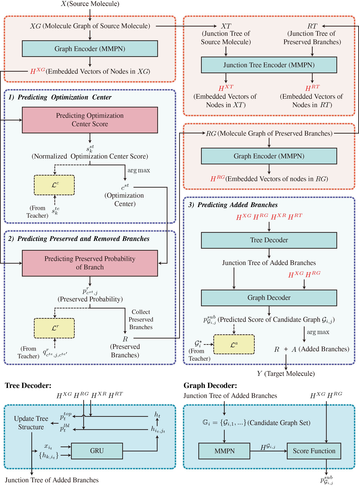

# T-S Polish

Here we provide the implementation of the T-S Polish Model along with some execution examples. 

The repo is modified based on Graph2Graph (https://github.com/wengong-jin/iclr19-graph2graph).

## Model Overview



## Requirements

* RDKit==2020.09.1.0
* PyTorch>=1.2.0
* Numpy==1.16.5
* scikit-learn==0.21.2
* pandas==0.25.1
* scipy==1.3.1

The code has been tested under python 3.6 with pytorch 1.2.0. 

## Quick Start
A quick summary of different folders:
* `data/` contains the training, validation and test set of all the tasks described in the paper.
* `branch_jtnn/` contains the implementation of graph polishing model.
* `props/` is the property evaluation module, including penalized logP, QED and DRD2 property calculation.
* `scripts/` provides evaluation and data preprocessing scripts.
* `util/` contains some useful common tools including logging tools, chemical process tools and so on. 

All the scripts for processing data, training and evaluation are placed under the root directory of this repo. 

All the best model in our experiment can be found in `saved/best_model`. 

## Preprocessing

For fast training, we need to first preprocess the training data. The preprocessing first calculate the center score and mark the reserved/removed/added branches, and then construct the junction tree structure. For instance, you can preprocess the training set of logp06 task using: 

```bash
# Generate score data for training set (mark the optimization center, preserved/removed/added branches)
python scripts/count_center_score.py --smiles_pair_file data/logp06/train_pairs.txt --result_file data/logp06/train_score_data.txt --ncpu 8

# Preprocess training file (for faster traning)
python scripts/preprocess.py --data_file data/logp06/train_score_data.txt --save_file data/logp06/train_trees.pkl --ncpu 8
```

To preprocess all the datasets, just run

```bash
bash preprocess.sh
```

## Vocabulary Extraction (Optional)

If you want to use your own dataset, you need extract a vocab file by the following scripts (For the existing dataset, all the vocab files has been extracted): 

```bash
# Generate vocab file, mol_file is all smiles data in your dataset
python scripts/gen_vocab.py --mol_file data/your_dataset/mols.txt --save_vocab_file data/your_dataset/vocab.txt --ncpu 32
```

## Training

 You can train our model on the qed task by

```bash
bash train.sh
```

Other tasks can run in a similar way (just change the parameter `TASK_TAG` in the script). 

Feel free to tune the hyper parameters to try to get better result.  In our default setting, `--hidden_size 300` sets the hidden state dimension to be 300, `--rand_size 8` sets the latent code dimension to be 8. `--epoch 30 --anneal_rate 0.95` means the model will be trained for 30 epochs, with learning rate annealing by 0.95. 

After each epoch, the model will be saved (default in the path `saved/model` from the project root).

## Validation & Testing

After training process, you can perform validation process on the qed task by

```bash
bash valid.sh
```

Other tasks can run in a similar way (just change the parameter in the script). 

After validation and choose the best model, you can use  `evaluation.py`  to test the performance of the best model. 

Here we provide an example script for running the evaluation process with all our best models for M1 task:

```bash
bash test.sh
```

You can run with all the best models for other tasks by changing the model path. 